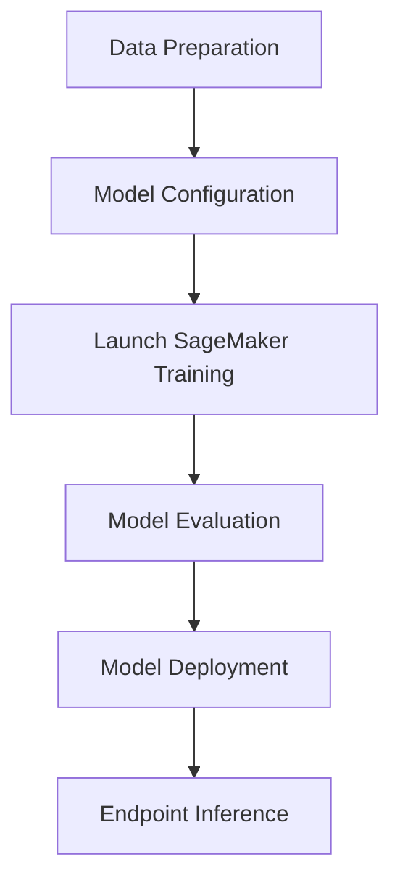

# LLM_PEFT_QLORA

## Introduction

LLM_PEFT_QLORA is a comprehensive repository designed to demonstrate the fine-tuning of Large Language Models (LLMs) using Parameter Efficient Fine-Tuning (PEFT) techniques and QLoRA. This solution provides a robust pipeline for data preparation, model configuration, training, evaluation, and deployment, specifically optimized for scalable and cost-effective workflows in the cloud.

## Features

- End-to-end pipeline for QLoRA and PEFT-based LLM fine-tuning
- Seamless AWS SageMaker integration for managed training
- Data preprocessing 
- Deployment approach for launching and monitoring endpoints on SageMaker

## Requirements

- Python 3.8 or later
- AWS CLI configured with proper credentials
- SageMaker Python SDK
- torch, transformers, datasets, and accelerate libraries
- Additional dependencies defined in `requirements.txt`
- An AWS account with permissions to create SageMaker resources

## Approach

### 1. Prepare Your Dataset

- Place your training and evaluation datasets in the `data/` directory.
- Use the provided scripts in the `preprocessing/` folder to clean and tokenize your data.

### 2. Configure Training Parameters

- Edit the configuration files in the `config/` directory to set your model, data paths, hyperparameters, and SageMaker settings.
- Choose options for PEFT and QLoRA in the configuration.

### 3. Launch Training 

- Start a training job:
- Monitor logs and training progress in the console.

### 4. Evaluate the Fine-Tuned Model

- After training, use the evaluation utilities to evaluate model.

### 5. Deploy the Model

- Deploy your trained model to an endpoint:
- Invoke the endpoint for real-time predictions using the client script.

## System Workflow Overview

## Sample Output (Ollama-based-for local or CPU based inferencing. Use vLLM for production-grade GPU based inferencing)

## Support

For issues or questions, please open an issue in the repository or contact the maintainer via GitHub.

This repository is licensed under the MIT License. See the LICENSE file for details.
